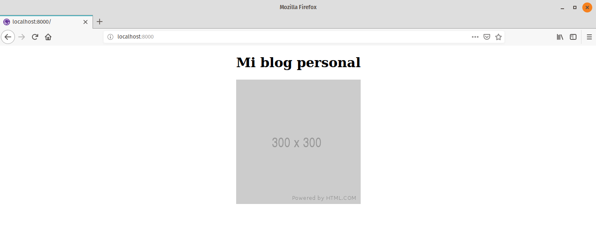
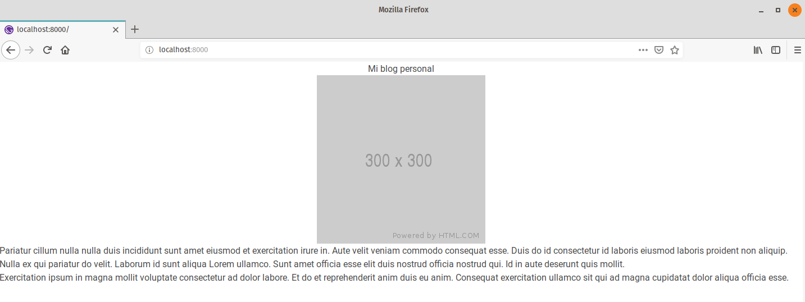
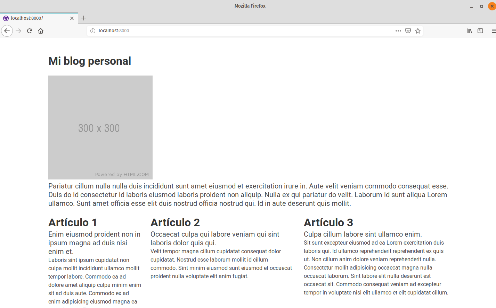
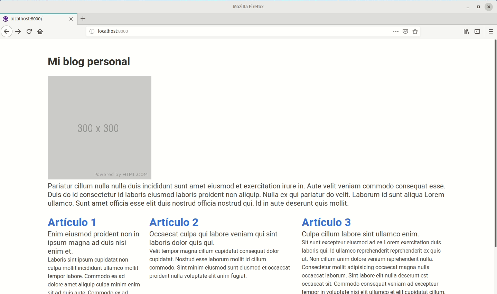

### Introducción

En el mundo del _Desarrollo Web_, existen dos alternativas fundamentales: _sitios estáticos_ y _sitios dinámicos_. Una de las preguntas más importantes respecto a herramientas como [Gatsby](https://www.gatsbyjs.org/) es **_¿por qué debo desarrollar un sitio estático?_**. Para tratar de responder esta pregunta, primero debemos definir las características de ambas alternativas:

#### Sitios Estáticos y Dinámicos

Los sitios estáticos, no son nada nuevo dentro del ámbito del desarrollo web. Desde el surgimiento de la [World Wide Web](https://es.wikipedia.org/wiki/World_Wide_Web) hemos estado rodeados de ellos y como su nombre lo indica son sitios que se conforman de páginas cuya característica principal es mantener información fija o estática.

Por ejemplo, los datos de contacto, el logotipo o la misión y visión de una empresa son datos que rara vez  requieren ser modificados y aunque este sea el caso, las actualizaciones estan separadas por largos períodos de tiempo (meses o años), por lo tanto podemos considerla como información permanente.

Por otra parte los sitios dinámicos, son sitios que requieren mantener información actualizada en todo momento. Bajo este esquema, el sitio debe reaccionar dinámicamente ante la actualización de la información o cualquier solicitud por parte del usuario.

Por ejemplo, consultar el pronóstico del clima, el estado de cuenta bancaria o recibir las publicaciones más recientes de nuestra red social favorita son algunas de las actividades que requieren de la intervención y coordinación de procesos externos o del lado del _Servidor_ para mantener la vigencia de la información.

Ambas alternativas juegan papeles muy diferentes y pueden complementarse en el desarrollo de un producto más robusto. La mejor opción siempre estará sujeta a las necesidades que requieras satisfacer.

#### Ventajas de los sitios estáticos

En [[1](https://www.quora.com/Why-do-people-use-a-static-site-generator),[2](https://dzone.com/articles/6-reasons-why-you-should-go-for-a-static-website),[3](https://scotch.io/bar-talk/5-reasons-static-sites-rock)] se discuten las ventajas que ofrece el desarrollo de sitios estáticos. A continuación presentamos algunas de las más relevantes.

1. **Seguridad.** Una de las mayores razones por las que los servidores son _hackeados_ es por estar atrasados respecto a las actualizaciones y parches de seguridad. Todos los problemas de seguridad con los sitios dinámicos tradicionales simplemente desaparecen en los sitios estáticos [[3](https://scotch.io/bar-talk/5-reasons-static-sites-rock)].
2. **Velocidad.** Al no requerir acceder constantemente a una base de datos para mantener la información actualizada, los sitios estáticos mantienen siempre la versión más reciente. Por lo tanto, los tiempos de descarga en el navegador son menores con respecto a los sitios dinámicos.
3. **Almacenamiento.** Los sitios estáticos se conforman por archivos HTML básicos que requieren menos espacio, lo que hace que el alojamiento sea más barato respecto a los sitios dinámicos [[2]](https://dzone.com/articles/6-reasons-why-you-should-go-for-a-static-website).

En esta segunda parte, continuaremos explorando las características de Gatsby para el desarrollo de sitios estáticos. Así mismo, se presenta un ejemplo nuevo a partir de una plantilla esencial.

### Crear un sitio en Gatsby

En esta sección vamos a desarrollar un nuevo sitio a partir de una plantilla esencial. Puedes consultar la [primer parte](https://mxlos.org/blog/tutorial-gatsby-parte-1) en la que se describe el proceso de instalación de Gatsby.

Para comenzar a construir nuestro sitio basado en la plantilla esencial, debemos ejecutar la siguiente instrucción desde la [Terminal](https://maker.pro/linux/tutorial/basic-linux-commands-for-beginners).
```bash
$ gatsby new my-blog https://github.com/gatsbyjs/gatsby-starter-hello-world
```
A continuación, debemos cambiarnos de ubicación al directorio recién creado.
```bash
$ cd my-blog
```
Con la siguiente instrucción, arrancamos el servidor en entorno de desarrollo. Puedes acceder a través de la dirección `http://localhost:8000` desde cualquier navegador web.
```bash
$ gatsby develop
```
A partir de este punto, podemos continuar editando y revisando el sitio gracias al mecanismo de **_hot-reloading_**.

Con el apoyo de un editor de texto como [Visual Studio Code](https://code.visualstudio.com/), podemos navegar por la estructura de directorios y archivos que se alojan en `my-blog`. Examinemos el contenido del archivo que produce la página inicial, es decir, `index.js`, ubicado en el siguiente directorio `my-blog/src/pages/`.
```jsx{numberLines: true}
import React from "react"

export default () => <div>Hello world!</div>
```
Actualicemos el encabezado de la siguiente manera.
```jsx{numberLines: true}
import React from "react"

export default () => (
  <div>
    <h1>Mi blog personal<h1> 
  </div>
)
```
Si deseamos centrar el texto del encabezado, podemos hacerlo de la siguiente manera.
```jsx{numberLines: 3}
...
<div>
  <h1 style={{ textAlign: `center` }}>Mi blog personal<h1>
</div>
...
```
Ahora, agreguemos una imagen.

```jsx{numberLines: 3}
...
<div>
  <h1 style={{ textAlign: `center` }}>Mi blog personal<h1>
  
</div>
...
```
Si deseamos centrar la imagen, podemos utilizar propiedades embebidas de estilo como en nuestro primer caso de la siguiente manera.
```jsx{numberLines: 3}
...
<div>
  <h1 style={{ textAlign: `center` }}>Mi blog personal<h1>
  
</div>
...
```
El resultado obtenido debe ser similar al siguiente.

Continuemos nutriendo el contenido de nuestra página principal, agreguemos un párrafo.
```jsx{numberLines: 3}
...
<div>
  <h1 style={{ textAlign: `center` }}>Mi blog personal<h1>
  

  <p>
    Pariatur cillum nulla nulla duis incididunt sunt amet eiusmod et exercitation irure in.
    Aute velit veniam commodo consequat esse.
    Duis do id consectetur id laboris eiusmod laboris proident non aliquip.
    Nulla ex qui pariatur do velit.
  </p>
</div>
...
```

Aunque a primera vista hemos estado desarrollando HTML básico, lo cierto es que estamos trabajando con notación [JSX](https://reactjs.org/docs/introducing-jsx.html), notación muy potente utilizada en la librería ReactJS. Tal como se mencionó anteriormente, estamos desarrollando un sitio web con la librería de ReactJS a través de Gatsby.

### Mejorando la apariencia

Podríamos ir mejorando el diseño utilizando hojas de estilo CSS o propiedades embebidas en las etiquetas, sin embargo para acelerar un poco esta etapa vamos a utilizar un [Framework CSS](https://es.wikipedia.org/wiki/Framework_de_CSS) llamado [Bulma](https://bulma.io/). 

Para su instalación, solo ejecuta el siguiente comando.
```bash
$ npm install bulma
```
> NOTA: Es muy importante detener previamente el servicio de Gatsby.

Una vez finalizada la instalación de Bulma, podemos regresar a la edición del archivo `index.js`. Para poder trabajar con Bulma necesitamos importar la hoja de estilos principal como se muestra a continuación.
```jsx{numberLines: 1}
import React from "react"
import "bulma/css/bulma.css" // highlight-line

export default () => (
...
```
Activemos nuevamente el servidor en entorno de desarrollo de Gatsby, utilizando el siguiente comando.
```bash
$ gatsby develop
```
El resultado debe ser similar al siguiente.



Podemos percibir un ligero cambio en el estilo del tipo de letra. Actualicemos nuevamente el contenido del archivo `index.js` de la siguiente manera.

```jsx{numberLines: 3}
...
export default () => (
  <div className="section">
    <div className="container">
      <h1 className="title">
          Mi blog personal
      </h1>
  
      
  
      <p className="subtitle">
        Pariatur cillum nulla nulla duis incididunt sunt amet eiusmod et exercitation irure in. 
        Aute velit veniam commodo consequat esse. Duis do id consectetur id laboris eiusmod laboris proident non aliquip.
        Nulla ex qui pariatur do velit.
      </p>
  
      <div className="columns">
        <div className="column is-3">
          <p className="title">Art&iacute;culo 1</p>
          <p className="subtitle">
            Enim eiusmod proident non in ipsum magna ad duis nisi enim et.
          </p>
          Laboris sint ipsum cupidatat non culpa mollit incididunt ullamco mollit tempor labore. 
          Commodo ea ad dolore amet aliquip culpa minim enim sit ad duis aute. 
          Commodo ex ad enim adipisicing eiusmod magna ea est voluptate.
          Excepteur eu voluptate irure aliquip in in officia voluptate anim.
        </div>
        <div className="column">
          <p className="title">Art&iacute;culo 2</p>
          <p className="subtitle">
            Occaecat culpa qui labore veniam qui sint laboris dolor quis qui.
          </p>
          Velit tempor magna cillum cupidatat consequat dolor cupidatat. 
          Nostrud esse laborum mollit id cillum commodo.
          Sint minim eiusmod sunt eiusmod et occaecat proident nulla voluptate elit anim fugiat.
        </div>
        <div className="column">
          <p className="title">Art&iacute;culo 3</p>
          <p className="subtitle">
            Culpa cillum labore sint ullamco enim.
          </p>
          Sit sunt excepteur eiusmod ad ea Lorem exercitation duis laboris qui. 
          Id ullamco reprehenderit reprehenderit ex quis ut. 
          Non cillum anim dolore veniam reprehenderit nulla. 
          Consectetur mollit adipisicing occaecat magna nulla occaecat laborum.
        </div>
      </div>
    </div>
  </div>
)
...
```

El resultado obtenido debe ser similar al siguiente.



Para consultar más características de Bulma visita su [documentación oficial](https://bulma.io/documentation/).

### Enlaces

Para esta sección, lo primero que necesitamos hacer es crear tres archivos dentro de la carpeta `pages`. La estructura de directorios debe ser similar a la siguiente.

```bash
my-blog/
└── src
    └── pages
        └── index.js
        └── article-one.js
        └── article-two.js
        └── article-three.js
        
```
> NOTA: Para evitar algún error, es muy importante dejar al final de cada archivo una línea en blanco.

El contenido de los archivos será el siguiente.

**article-one.js**

```jsx{numberLines: true}
import React from "react"

const ArticleOne = () => (
  <div className="section">
    <div className="container">
      <h1 className="title">Art&iacute;culo 1</h1>
      <p className="subtitle">Enim eiusmod proident non in ipsum magna ad duis nisi enim et.</p>
      Laboris sint ipsum cupidatat non culpa mollit incididunt ullamco mollit tempor labore. Commodo ea ad dolore amet aliquip culpa minim enim sit ad duis aute. Commodo ex ad enim adipisicing eiusmod magna ea est voluptate. Excepteur eu voluptate irure aliquip in in officia voluptate anim. Officia nulla elit ullamco fugiat.
    </div>
  </div>
)

export default ArticleOne
```

**article-two.js**

```jsx{numberLines: true}
import React from "react"

const ArticleTwo = () => (
  <div className="section">
    <div className="container">
      <h1 className="title">Art&iacute;culo 2</h1>
      <p className="subtitle">Occaecat culpa qui labore veniam qui sint laboris dolor quis qui.</p>
      Velit tempor magna cillum cupidatat consequat dolor cupidatat. Nostrud esse laborum mollit id cillum commodo. Sint minim eiusmod sunt eiusmod et occaecat proident nulla voluptate elit anim fugiat.      
    </div>
  </div>
)

export default ArticleTwo
```

**article-three.js**

```jsx{numberLines: true}
import React from "react"

const ArticleThree = () => (
  <div className="section">
    <div className="container">
      <h1 className="title">Art&iacute;culo 3</h1>
      <p className="subtitle">Culpa cillum labore sint ullamco enim.</p>
      Sit sunt excepteur eiusmod ad ea Lorem exercitation duis laboris qui. Id ullamco reprehenderit reprehenderit ex quis ut. Non cillum anim dolore veniam reprehenderit nulla. Consectetur mollit adipisicing occaecat magna nulla occaecat laborum. Sint labore elit nulla deserunt est occaecat sit. Commodo consequat veniam ad excepteur tempor in voluptate nisi elit ullamco et elit cupidatat cillum.      
    </div>
  </div>
)

export default ArticleThree
```
Los hipervínculos o enlaces son una pieza fundamental en cualquier sitio web, estos nos permiten navegar entre las secciones del mismo. Para poder implementar esta característica en Gatsby, vamos a importar el componente _**Link**_. Esto lo puedes realizar de la siguiente manera.


```jsx{numberLines: 1}
import React from "react"
import { Link } from "gatsby" // highlight-line
import "bulma/css/bulma.css"

export default () => (
...
```
Agreguemos el enlace al artículo uno, como se muestra a continuación.

```jsx{numberLines: 19}
...
<div className="column is-3">
  <p className="title"><Link to="./article-one">Art&iacute;culo 1</Link></p>
...
```
Este proceso se répite para el resto de artículos.
```jsx{numberLines: 24}
...
<div className="column is-3">
  <p className="title"><Link to="./article-two">Art&iacute;culo 2</Link></p>
...
```

```jsx{numberLines: 29}
...
<div className="column is-3">
  <p className="title"><Link to="./article-three">Art&iacute;culo 3</Link></p>
...
```

El resultado obtenido debe ser similar al siguiente.



Como puedes observer ha sido muy sencillo agregar enlaces a nuestro sitio.


Para finalizar esta sección, agreguemos un enlace de retorno para evitar el uso del botón en el navegador. Esto lo podemos realizar de la siguiente manera.

**article-one.js**

```jsx{numberLines: 1}
import React from "react"
import { Link } from "gatsby" // highlight-line

const ArticleOne = () => (
  { /* highlight-range{6-8} */ }
  <div className="section">
    <div className="container">
      <h1 className="title">Art&iacute;culo 1</h1>
      <p className="subtitle">Enim eiusmod proident non in ipsum magna ad duis nisi enim et.</p>
      Laboris sint ipsum cupidatat non culpa mollit incididunt ullamco mollit tempor labore. Commodo ea ad dolore amet aliquip culpa minim enim sit ad duis aute. Commodo ex ad enim adipisicing eiusmod magna ea est voluptate. Excepteur eu voluptate irure aliquip in in officia voluptate anim. Officia nulla elit ullamco fugiat.
      <footer style={{ marginTop: `25px` }}>
        <Link to="/">Regresar</Link>
      </footer> 
    </div>
  </div>
)

export default ArticleOne
```

Agrega el mismo código para los archivos `article-two.js` y `article-three.js`. El resultado obtenido debe ser similar al siguiente.


### Conclusiones

En esta segunda parte, se describieron las características de los sitios estáticos y dinámicos. Se manifestaron algunas de las ventajas que conlleva el desarrollo de un sitio estático. Además se muestran los pasos para desarrollar un sitio estático con Gatsby a partir de una plantilla esencial. Para finalizar, se muestra la implementación de enlaces o hipervínculos en el sitio estático desarrollado.

### Referencias
   1. [Why do people use a static-site generator?](https://www.quora.com/Why-do-people-use-a-static-site-generator)
   2. [6 Reasons Why You Should Go for a Static Website](https://dzone.com/articles/6-reasons-why-you-should-go-for-a-static-website)
   3. [5 Reasons Static Sites Rock!](https://scotch.io/bar-talk/5-reasons-static-sites-rock)