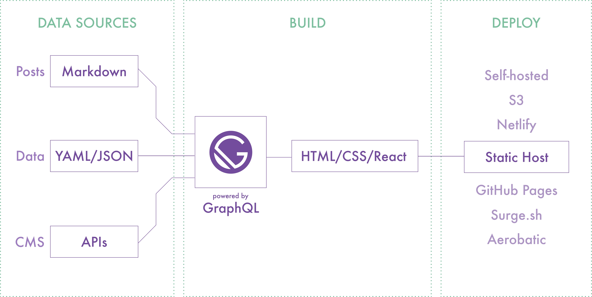

A manera de taller, durante los últimos fines de semana (para ser exacto los últimos tres) algunos miembros de la comunidad nos hemos reunido en las instalaciones del espacio de _Coworking_ [La Playa Deluxe](https://www.facebook.com/LaPlayaDeLux/) con el objetivo de conocer e implementar conceptos básicos de la herramienta de desarrollo ágil para sitios estáticos [GatsbyJS](https://www.gatsbyjs.org/).

Está herramienta se sustenta sobre los conceptos de [ReactJS](https://reactjs.org/), por lo que, si has trabajado anteriormente con ReactJS no tendrás problemas en adaptarte a GatsbyJS. Aunque para ser honesto, puedes comenzar con GatsbyJS para inclusive aprender ReactJS. GatsbyJS proporciona diferentes tipos de **_plugins_** para extender su funcionalidad (librerías que proveen funcionalidad particular). En la siguiente imágen se puede observar la arquitectura que ofrece GatsbyJS.



Describiendo la anterior imágen de izquierda a derecha, contamos con tres secciones:

### 1. **Data Sources**
GatsbyJS te permite utilizar diferentes tipos de archivos como fuentes de datos, tales como: CSV, JSON, YAML, información que provenga de un CMS. Es decir, 
### 2. **Build**
### 3. **Deploy**

1. Introducción a Gatsby.
2. Instalación.
3. Desarrollo de las primeras páginas.
4. Configuración de Plugins.
5. Administración de rutas en el sitio.
6. Como consumir al API de Meetup.

y adquieras un poco de la experiencia que vivimos al comenzar a trabajar con Gatsby.


```sh
$ node -v
```